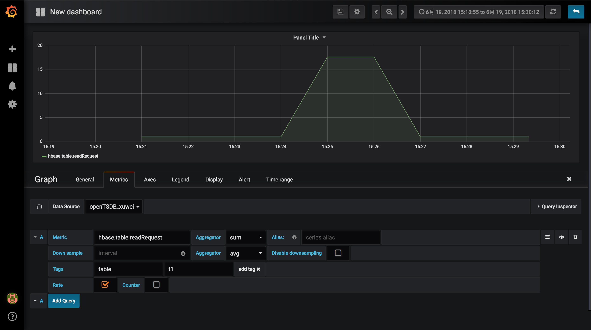

# OpenTSDB 使用rate获取增量数据测试

测试数据

```shell
hbase.table.readRequest 1529392800 2800 table=t1    
hbase.table.readRequest 1529392860 2860 table=t1 
hbase.table.readRequest 1529392920 2920 table=t1 
hbase.table.readRequest 1529392980 2980 table=t1 
hbase.table.readRequest 1529393040 3040 table=t1 
hbase.table.readRequest 1529393100 4100 table=t1 
hbase.table.readRequest 1529393160 5160 table=t1  
hbase.table.readRequest 1529393220 5220 table=t1  
hbase.table.readRequest 1529393280 5280 table=t1 
hbase.table.readRequest 1529393360 5360 table=t1 
```

导入到OpenTSDB

```shell
[root@cdh129130 opentsdb-2.3.0]# vim import_table_read_request_t1
[root@cdh129130 opentsdb-2.3.0]# gzip import_table_read_request_t1
[root@cdh129130 opentsdb-2.3.0]# JVMARGS="-Djava.security.auth.login.config=./login.config -Dzookeeper.sasl.client=false" tsdb import  /tmp/futeng/import_table_read_request_t1.gz
```


封装 HTTP body with json

```json
{
    "start": 1529392800,
    "end": 1529393360,
    "globalAnnotations": true,
    "queries": [
        {
            "aggregator": "avg",
            "metric": "hbase.table.readRequest",
            
            "rate":true,
            "tags": {
                "table": "t1"
            }
        }
    ]
}
```

HTTP POST 连接测试

```http
http://192.168.129.130:4242/api/query
```

返回值

```json
[
    {
        "metric": "hbase.table.readRequest",
        "tags": {
            "table": "t1"
        },
        "aggregateTags": [],
        "dps": {
            "1529392860": 1,
            "1529392920": 1,
            "1529392980": 1,
            "1529393040": 1,
            "1529393100": 17.666666666666668,
            "1529393160": 17.666666666666668,
            "1529393220": 1,
            "1529393280": 1,
            "1529393360": 1
        }
    }
]
```


Grafana 中呈现


