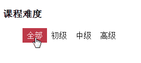
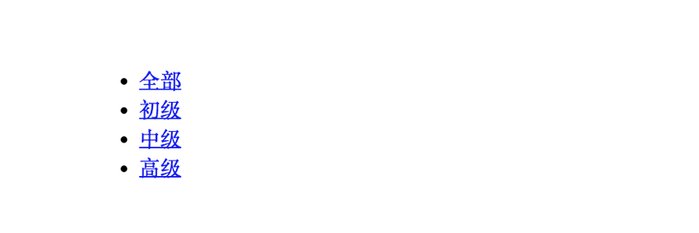

# 滑动列表链接菜单 menu list a 


#演示

今天来记忆一段简单却实用的CSS效果实现：滑动列表链接菜单。



[JSFiddle 代码效果展示](https://jsfiddle.net/futeng/L8jguktn/)

# 记忆


```
<div>
    <li><a href="#">全部</a></li>
    <li><a href="#">初级</a></li>
    <li><a href="#">中级</a></li>
    <li><a href="#">高级</a></li>
</div>
```

`div-list-a`结构是常见的菜单实现方案：

1. 外层div方便控制菜单整体样式；
2. list（li要记做list）为分隔菜单项；
3. a标签让菜单有超链接效果；




上图是`div-list-a`默认实现效果，**重点**在于闭上眼睛你应该能浮现出这种上下排列，前面有个项目原点符号，链接蓝不溜秋的样子。

让我们具备光速处理数据的大脑将上面的默认画面多过几遍。我们要做的就是发挥完美主义精神，化默认（腐朽）为神奇：

1. 先让列表横起来：`float: left;`
2. 去除列表前面的原点，也就是去除列表的默认样式：`list-style-type: none;`

大脑就像一个告诉渲染引擎，每一步你都应该很清楚发生了什么。
执行完上面两步，效果如下:


发现菜单都挤到一起，这里出现了最难的部分：如何让菜单项之间有间隔呢。

此时关键字『间隔』将提取我们记忆中关于内外填充的知识。

1. 将菜单项分开，也就是让list

1. 让列表浮动起来（此时列表排列在一行，但是左右挤在一起）；
2. 分开列表（加上宽度终于不挤了）；
3. 去掉列表的基本样式（此时没有项目符号了）；
4. 加上高度（一加上高度，内容就不居中了）；
5. 设置行高（终于对齐了）；
6. 在水平对齐（搞定）；

链接的默认样式是下划线，要注意`a`是内联元素所以hover过去只有文字现实背景，好了开始联想：

1. 去掉下划线这些默认的样式；
2. 给`hover`和`active`加上背景色；
3. 为了凸显反差在定义此时的前景色为白色；
4. 浏览页面验证下发现只有文字有背景，让`a`变成块级标签来；（done）


# 源码

> atext: `;csslista`

```
.sample_class li{
    float: left;
    width: 50px;
    list-style-type: none;
    height: 30px;
    line-height: 50px;
    text-align: center;
}

.sample_class li a {
    text-decoration: none;
    color: #000;
    display:block;
}

.menu li a:hover, .menu li a:active {
    background-color: #BE3948;
    color: #FFF;
}
```