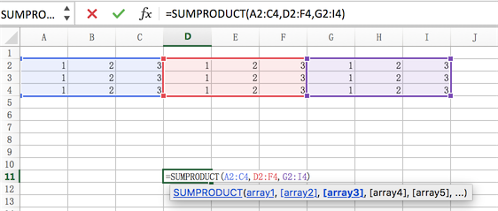

# SUMPRODUCT

## 乘积和
乘积 和，即 **对应**相乘 再 求和。

求贴砖人工总费用，注意有两项（`4.49*25 + 21*25`）。

Excel = `=SUMPRODUCT(C1:C2, D1:D2)`

编号 A| 项目 B | 数量 C| 人工单价 D
----|----|----|----
1| 地面贴砖（平方）  |4.49 	|   25
2| 墙面贴砖（平方）  |21.00 	|   25
3| 包下水管（个）	|1.00 		|   120
4| 包燃气管（个）	|1.00 		|   50
5| 烟道加固（个）	|1.00 		|   200
6| 瓷砖磨边（米）	|11.00 		|   10

### 多区域乘积和

多区域乘积和`=SUMPRODUCT(A2:C4,D2:F4,G2:I4)`，无非把多个区域内对应位置数相乘，最后求和。

即`A2*D2*G2 + A3*D3+G3 + A4*D4*G4 + B2*E2*H2` ...




## Tips

### Product

> 来源于 [Dictionary.com](http://www.dictionary.com/browse/product?s=t)


```
noun

1. a thing produced by labor:
products of farm and factory; the product of his thought.

2. a person or thing produced by or resulting from a process, as a natural, social, or historical one; result:
He is a product of his time.

3. the totality of goods or services that a company makes available; output:
a decrease in product during the past year.

4. Chemistry. a substance obtained from another substance through chemical change.

5. Mathematics. the result obtained by multiplying two or more quantities together.
intersection (def 3a).
```

`Product`这个词核心要体现：其是人力劳动的产出物，强调过程性且必须有产出物。

下面我有个很有意思的猜想：

农耕时代，广大老百姓生产出来的比如一袋米，一批布等就是他们的`product`。

但随着欧洲商品经济来临，很多人的`product`其实就是帮地主或者资本家打工得报酬。可以想象，有那么一个资本家给他的雇佣工发工资：

> Hi, Willem 你这个月的**Product**就是你 **(每天的工钱 * 干了28天)**。

自此`Product`便有了乘积的概念。 :)


