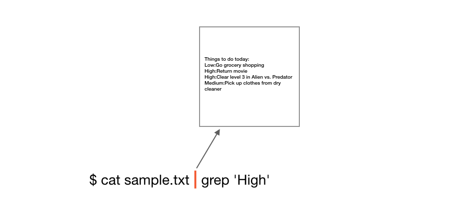
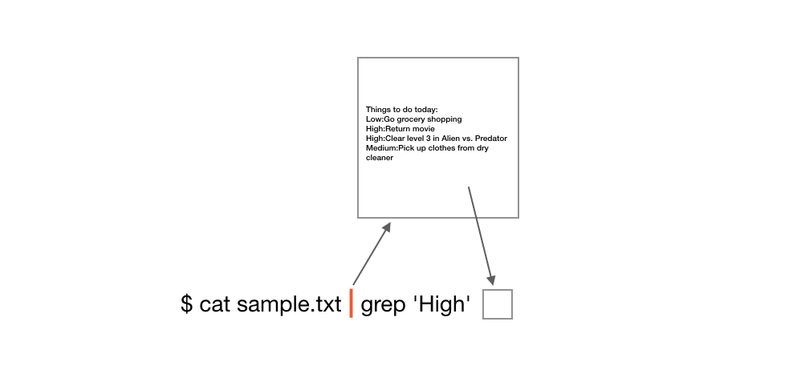
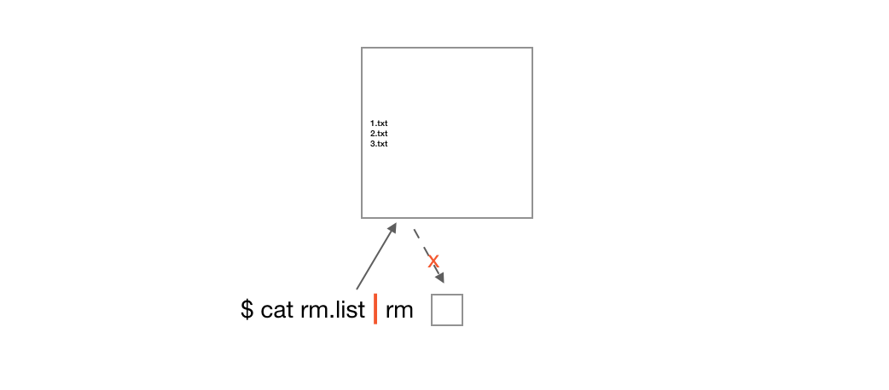
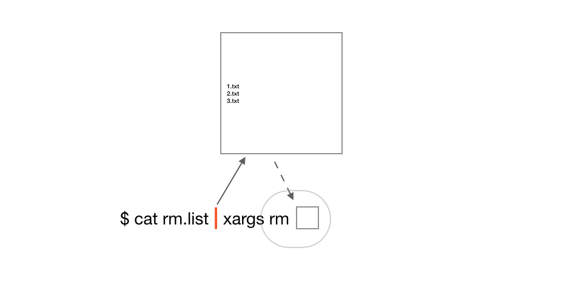

# xargs - 地下管道


`xargs` 促使我去思考，管道 `|` 的具象含义是什么。

```
$ cat sample.txt
Things to do today:
Low:Go grocery shopping
High:Return movie
High:Clear level 3 in Alien vs. Predator
Medium:Pick up clothes from dry cleaner
```
用管道符号可以组合出更实用的内容：优先级为 `High` 任务数量为 2。

```
$ cat sample.txt | grep 'High' | wc -l
       2
```


其中 `cat` 命令接收一个参数，并将其内容打印到标准输出：当前屏幕。

本例中 sample.txt 内容并没有输出到屏幕上，内容被重定向到管道命令 `|` 缓存中了。




而 `grep` 命令需要两个参数，例如：`grep 'Frank' name-list.csv`，将从 name-list.csv 文件中查询有关键字 Frank 的行。

本例中第二个关键字是缺失的，`grep` 实际是从管道缓存里面读取了数据。



```
$ cat sample.txt | grep 'High' | wc -l 
```

拼接命令的最后一个参数默认从管道里读取数据。

以上示例中 `wc -l` 命令如何读取从 `grep` 传到管道的数据，你就很容易想象了。

> 管道命令 `|` 是如此优雅的让多个命令合作无间，就像一个充满魅力的领航员，带领大家前进。 


但一些早期命令，例如 `rm`,`cp` 等是不支持管道命令。你永远无法使用类似 `cat rm.list | rm` 的方式删除 rm.list 中列出的文件。

```
$ ls -l
1.txt                                         
2.txt
3.txt
rm.list

$ cat rm.list
1.txt
2.txt
3.txt
```



很遗憾，`rm` 命令就是无法从管道中读取数据。

管道命令 `|` 是如此优雅，以至于那些不支持从管道读取数据的命令都很令人恼火（大多是早期命令）。这些命令就像反抗军，在地下悄悄的、分散着活动着。

而 `xargs` 就像 `Neo`一样，横空出世，将以一己之力整合这些地下武装，我称之为：**The One**， 中文名：**地下管道**。


```
$ cat rm.list | xargs rm
```



`xargs` 获取管道数据（同样作为自己的最后一个参数）并组织成 `rm` 命令的参数，再调用 `rm`，完成工作。

**这就是一个经典的回调。**

```
function xargs(cmd, args...) {
   cmd args...
}

xargs(rm, rm.list)
```

向 `xargs` 中传进命令和该命令执行需要的参数，函数体内中再封装，让这个命令能正确读取参数，最后执行命令，完成工作。

```
$ cat rm.list | xargs cat
from 1.txt
from 2.txt
from 3.txt
```

上例中，`xargs` 读取管道内容（一些列文件名），在执行 `cat` 命令时，将这些文件名作为参数传进 `cat` ，由此`cat` 一次性读取了三个文件里面的内容。

试想如果`rm.list`内容组织是以`,`分割（1.txt,2.txt,3.txt），`cat` 似乎就无法读取了。

你可能敏锐的感觉到了，如何组织好数据以让回调的命令能正确的作为参数读取，是使用好 `xargs` 的关键。

（`xargs` 提供了很多选项，让你尽快能舒服的组织好这些参数。这些大家随手可搜，多加练习即可。）

**最后：`xargs` 就像 The One （地下管道），组织起那些反叛的命令军，抵抗到底。**

