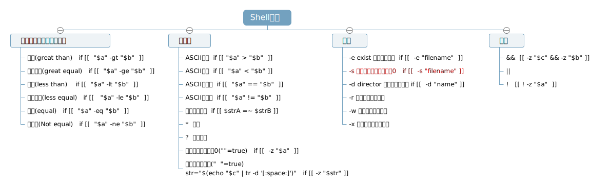

# Bash Shell 整数 字符串 判断 比较




用 Bash Shell 做判断，简单起见：

1. 统一使用 `if [[   ]] ` 即两个中括号格式，废弃 `[]`，`(())`格式，后面两种得出的结论常与我们的想象有较大差距；
2. Bash Shell 不能做浮点数判断，请使用bc、awk，后文附；
3. Bash Shell 中整数判断使用的是类似 `-gt` 的字符形式，常见的 `>` 被使用在字符串ASCII序的比较上，比较混淆；
4. `-e` 等是单元运算符，用作 test ；

可简单使用脚本做测试

```
strA="helloworld"
strB="low"
if [[ $strA =~ $strB ]]
then
    echo "包含"
else
    echo "不包含"
fi
```

## 判断字符串长度是否为0（空串）

`-z` 判断字符串长度是否为0，仅仅是长度判断，如果有多个空格组成的字符串显然长度不为0：

1. `v1=""` -z 判断为 true；
2. `v2="  "` -z 判断为 false；
3. `v3="  \r\n  "` -z 判断为 false；


## 判断字符串内容是否为空（空串或由空格换行等组成）

使用 `tr` 给trim 掉字符串中所有空格，如果给trim干净了，则认为内容为空。

```
c="    \n\r "

str="$(echo "$c" | tr -d '[:space:]')"

if [[ -z "$str" ]]
then
	echo "true"
else
	echo "false"
fi

> true
```


## 判断浮点数

[使用 bc 做浮点数判断][1]

```
key1="12.3"
result="12.2"
if [ $(bc <<< "$result <= $key1") -eq 1 ]
    then
    # some code here
fi
```


[使用awk做浮点数判断][1]

```
key1=12.3
result=12.5
var=$(awk 'BEGIN{ print "'$key1'"<"'$result'" }')    
# or var=$(awk -v key=$key1 -v result=$result 'BEGIN{print result<key?1:0}')
# or var=$(awk 'BEGIN{print "'$result'"<"'$key1'"?1:0}')
# or 
if [ "$var" -eq 1 ];then
  echo "do something"
else
  echo "result more than key"
fi
```


[1]:https://stackoverflow.com/questions/2424770/floating-point-comparison-in-shell-script
